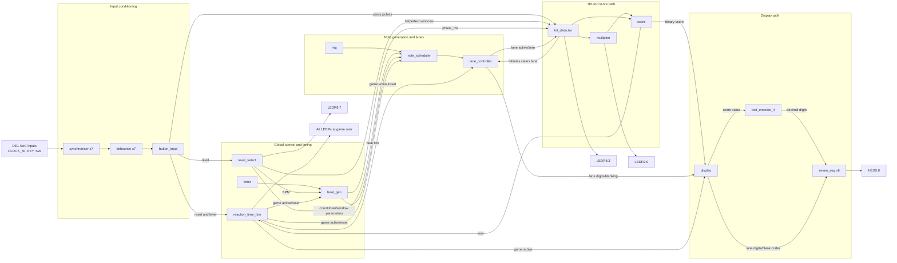

# Assignment 1 Demo and Q&A Notes

Date: Thursday 3 September 2026

Personal focus: scoring, multiplier, hit classification, perfect-hit feedback,
penalties, score display, and game-over behaviour.

## The one-sentence architecture

`hit_detector` classifies each button event, `multiplier` converts successful
events into a streak and event multiplier, `score` applies gains and penalties
with saturation, `display` shows the score, and `reaction_time_fsm` stops the
game and flashes the LEDs when the score reaches 99.

Data flow to draw or say:

```text
KEY -> button_input -> press_pulse -> hit_detector
                                      | normal_hit / perfect_hit
                                      | miss / forfeit / stray
                                      v
                                  multiplier -> hit_multiplier
                                      |              |
                                      |              v
                                      +-----------> score -> won
                                                        |
                                  display <---------+----> reaction_time_fsm
```

## Whole-project topology

You do not need to know every implementation detail. For the modules outside
your area, remember their place in this flow and one sentence about what they
own.



### Module hierarchy and the one fact to remember

```text
top_level
|-- button_input             physical input conditioning and one-shot presses
|   |-- debounce x7          rejects mechanical switch/key bounce
|   +-- synchroniser x7      two-flop asynchronous-input synchronisation
|-- reaction_time_fsm        RESET / PLAYING / GAME_OVER lifecycle
|-- level_select             latches difficulty and outputs its parameters
|-- beat_gen                 exact-average musical BPM tick and beat phase
|   +-- timer                50 MHz to millisecond phase counter
|-- rng                      deterministic ten-bit LFSR pseudo-random source
|-- note_scheduler           reserves future lane/countdown events
|-- lane_controller          owns active/zero lane state and visible countdown
|-- hit_detector             classifies presses and times hit feedback
|-- multiplier               owns streak, multiplier and LED bar
|-- score                    owns points, penalties, saturation and won
+-- display                  owns all six physical HEX outputs and blanking
    |-- bcd_encoder_4        binary score to decimal digits
    +-- seven_seg x6         decimal/blank value to active-low segments
```

### The shallow explanation for each unfamiliar module

| Module | What goes in | What comes out | Why it exists |
|---|---|---|---|
| `top_level` | Board clock, keys and switches | HEX and LEDR pins | Integration boundary; it should contain wiring rather than game algorithms. |
| `synchroniser` | Asynchronous physical input | Clock-domain-safe level | Two flip-flops reduce metastability risk before any input is used. |
| `debounce` | Synchronised noisy key/switch | Stable level | A mechanical contact toggles several times; only a sufficiently stable value is accepted. |
| `button_input` | KEY3:0 and SW2:0 | `press_pulse`, reset and level | Converts active-low keys into one-cycle events and prevents holding from scoring repeatedly. |
| `reaction_time_fsm` | Reset request, level change and `won` | Game/round resets and active/game-over state | Owns the whole-game lifecycle, not the individual lane countdowns. |
| `level_select` | Debounced SW2:1 | BPM, ranges, windows, cadence, chord cap and LEDs | Keeps every difficulty parameter consistent and applies changes at a clean reset boundary. |
| `beat_gen` | Clock, reset and selected BPM | `beat_tick` and `phase_ms` | Quantises all note movement to the song beat using a fractional accumulator. |
| `timer` | 50 MHz clock and beat reset | Milliseconds since the beat | Contains the required 50 MHz-to-1 ms prescaler; the hit detector uses its phase. |
| `rng` | Clock | Ten pseudo-random bits | An LFSR gives a repeatable sequence for testing and variable lane/countdown choices in play. |
| `note_scheduler` | Beat, RNG and difficulty parameters | Future lane countdowns and `due_notes` | Places notes into future beat slots while enforcing per-lane spacing and chord limits. |
| `lane_controller` | Due notes, future countdowns and hit/miss clears | Lane active/zero state and four display digits | Owns what each lane is currently showing; it does not decide whether a press is valid. |
| `hit_detector` | Press pulse, lane state and beat phase | Hit/miss/forfeit/stray events and lane LEDs | Separates timing judgement from lane storage and scoring. |
| `display` | Lane values/activity and binary score | HEX5:0 segments | Centralises lane blanking and score display ownership. |
| `bcd_encoder_4` | Binary value | Four decimal digits | Converts binary score data into decimal before segment decoding. |
| `seven_seg` | One decimal or blank code | Seven active-low segment bits | Contains the physical digit truth table used by all six displays. |

### Three end-to-end stories to remember

1. **A note appears:** `rng` supplies a lane/countdown choice, `note_scheduler`
   reserves it on a musical beat, and `lane_controller` displays it and advances
   it toward zero on later beats.
2. **The player presses:** `synchroniser` and `debounce` clean the key,
   `button_input` creates one pulse, and `hit_detector` classifies it using the
   registered lane state and milliseconds since the beat.
3. **The result becomes visible:** the event updates `multiplier` and `score`,
   `display` converts the score to HEX5:4, and `reaction_time_fsm` enters
   game-over if `won` reaches 99.

If asked about a module outside your area, give its owner sentence, name the
signals immediately before and after it, and then connect it back to the
end-to-end story. That is enough topology without pretending to know internals
you did not implement.

## Current values to remember

| Behaviour | Current value |
|---|---:|
| Normal hit | 1 base point |
| Perfect hit | 2 base points |
| Early/forfeit penalty | -1 point |
| Blank-lane/stray penalty | -1 point |
| Miss by timeout | no point loss, but streak resets |
| x2 multiplier | hit/streak 6 |
| x3 multiplier | hit/streak 16 |
| Maximum multiplier | x3 |
| Score range | 0 to 99, saturating |
| Normal hit LED | solid for 250 ms |
| Perfect hit LED | fast 50 ms on/off flashing within the same 250 ms |
| Easy perfect window | first 250 ms of the 700 ms hit window |
| Medium perfect window | first 150 ms of the 400 ms hit window |
| Hard perfect window | first 80 ms of the 250 ms hit window |
| Easy tempo | 83 BPM, Come Together |
| Medium/Hard tempo | 123 BPM, Get Back |

LED mapping:

```text
LEDR9:7  difficulty: Easy=100, Medium=010, Hard=001
LEDR6:3  lane hit indicators
LEDR2:0  multiplier bar: x1=100, x2=110, x3=111
All LEDRs flash together at game over.
```

The difficulty indicator is one-hot. The multiplier indicator is a growing bar.

## Before the marked ten minutes

Use the 30-minute setup period deliberately:

- Program the newest `build/top_level/top_level.sof`, not the smoke-test SOF.
- Confirm the build includes the 123 BPM Medium/Hard change.
- Check `SW0` reset and `SW2:SW1` difficulty selection.
- Confirm KEY0/HEX0/LEDR3 through KEY3/HEX3/LEDR6 mapping.
- Confirm Easy lights LEDR9, Medium LEDR8, and Hard LEDR7.
- Get at least six clean hits and verify the x2 bar becomes `LEDR2:1`.
- Confirm a perfect hit gives double points and a visibly faster LED flash.
- Confirm an early press subtracts one point and destroys that live note.
- Confirm a blank-lane press subtracts one point.
- Confirm holding a key produces only one press event.
- Cue the exact audio version used to validate 83 or 123 BPM.
- Decide who starts the song and who releases reset. Use a spoken countdown.
- Keep these files open in the editor:
  - `rtl/common/game_params.svh`
  - `rtl/game/score.sv`
  - `rtl/game/multiplier.sv`
  - `rtl/game/hit_detector.sv`
  - `rtl/top/top_level.sv`
  - the matching three unit tests
- Keep ModelSim open with the project compiled if possible.
- Keep a terminal ready to rerun the test suite.

Do not use the marked demo slot for programming unless absolutely necessary.

## Ten-minute group plan

Aim to finish Part A in six minutes, leaving about four minutes for the live
change request.

| Time | Demonstration | Essential narration |
|---|---|---|
| 0:00-0:30 | Interface overview | Four lanes are HEX3:0/KEY3:0, score is HEX5:4, lane hit LEDs are LEDR6:3. |
| 0:30-1:15 | Reset and countdowns | Reset clears score and lanes. Notes receive varied countdowns and inactive lanes are blank. |
| 1:15-2:00 | Normal hit and mistimed press | A correct zero-window press scores and flashes its lane. Early and inactive-lane presses are penalised. |
| 2:00-3:30 | Your scoring/multiplier section | Explain normal versus perfect points, perfect flash, streak thresholds, multiplier bar, saturation and penalties. |
| 3:30-4:15 | Difficulty selection | Show SW2:1, automatic clean restart, level LED, windows/ranges, and occasional Hard chords. |
| 4:15-4:45 | RNG and scheduler | RNG selects lane/countdown; deterministic cadence keeps the minimum note rate. |
| 4:45-5:10 | Song synchronisation | Play at least 15 seconds, beginning the song and reset together. |
| 5:10-5:40 | Reset and testing evidence | Show complete reset and name the self-checking unit/system tests. |
| 5:40-6:00 | Design summary | State the most important design decisions without waiting to be asked. |
| 6:00-10:00 | Live change request | Locate, edit, run the relevant test, and explain the result. |

## Your 90-second spoken section

Use this as a structure rather than memorising it word for word:

> My part is the scoring and multiplier path. The hit detector first produces
> mutually exclusive per-lane events: normal hit, perfect hit, miss, early
> forfeit, or stray press. That separation is important because a perfect hit
> must not also count as a normal hit.
>
> The score module pop-counts all four lanes rather than OR-reducing them, so
> simultaneous notes and simultaneous penalties are handled correctly. A normal
> hit is worth one, a perfect hit is worth two, and the successful total is
> multiplied by the current event multiplier. Early and blank-lane presses each
> subtract one. The update uses a signed intermediate and clamps from zero to 99,
> so it cannot underflow or wrap around.
>
> The multiplier is based on consecutive successful notes: x2 starts on hit six
> and x3 starts on hit sixteen. We calculate a separate combinational event
> multiplier from the candidate streak so the threshold hit receives the
> multiplier it just unlocked. A registered-only implementation would be one
> clock late. Misses, early presses and stray presses reset the stored streak.
>
> The LEDs make the behaviour visible: x1, x2 and x3 form a growing bar from
> LEDR2 toward LEDR0. A normal hit gives a solid 250 millisecond lane flash,
> while a perfect hit flashes quickly so the double score is understandable.
> At 99, the score saturates, gameplay stops, the score remains visible and all
> ten LEDs flash until reset.

## Design decisions to volunteer unprompted

### 1. Perfect and normal are mutually exclusive

`hit_detector` defines:

```text
perfect_hit = hit AND in_perfect
normal_hit  = hit AND NOT in_perfect
```

This prevents a perfect note being scored once as perfect and again as normal.
The score and multiplier modules also contain assertions that fail if both are
ever asserted for the same lane.

### 2. The perfect window is at the leading edge

The perfect window is the first part of the normal zero-window, not its middle.
`phase_ms` resets on the musical beat. A note becomes due at that beat, so a
press with `phase_ms < perfect_ms` is perfect. A press before the note reaches
zero is an early forfeit, not an early perfect.

### 3. Perfect hits need visible feedback

Originally, double score alone could look like an unexplained scoring error.
The final design keeps the normal 250 ms solid flash and makes a perfect hit
flash rapidly in 50 ms phases during the same total interval.

### 4. Event multiplier versus displayed multiplier

There are deliberately two multiplier signals:

- `multiplier_value`: decoded from the stored streak and shown on LEDs.
- `hit_multiplier`: decoded from `stored streak + successes this clock` and
  sampled by `score` on the event edge.

This solves the nonblocking-assignment timing problem. Hit six receives x2 and
hit sixteen receives x3 instead of the multiplier arriving one hit late.

### 5. Chords are counted, not collapsed

The event inputs are four-bit vectors. Both `score` and `multiplier` count the
set bits. A two-note chord can therefore add two streak steps and score both
notes. Every note in that chord receives the same multiplier determined from
the complete candidate streak, avoiding an arbitrary lane order.

### 6. Penalties discourage mashing without being too harsh

- Early press on an active countdown: destroys the note, subtracts one, resets
  the streak.
- Press on an inactive lane: subtracts one and resets the streak.
- Letting a zero-window time out: clears the note and resets the streak, but
  does not subtract a point.
- Holding a key: `button_input` generates only one `press_pulse`, so a held key
  cannot score future notes.

The distinction is intentional: deliberate bad inputs lose points, while a
passive miss loses the multiplier opportunity without making the game
unnecessarily punishing.

### 7. Saturation and terminal game state

The score update is conceptually:

```text
base_gain = normal_count * 1 + perfect_count * 2
gain      = base_gain * event_multiplier
loss      = forfeit_count * 1 + stray_count * 1
candidate = old_score + gain - loss
new_score = clamp(candidate, 0, 99)
```

The signed candidate prevents an unsigned underflow from becoming a large
positive score. At 99, `won` is asserted and the score register holds 99 even
if later event signals occur. The lifecycle FSM then clears live lanes, blanks
HEX3:0, preserves 99 on HEX5:4, and flashes all LEDs. Reset is the only exit.

## Likely Q&A questions

### Why use a signed intermediate in `score`?

Because gains and penalties may happen on the same clock and the result can be
temporarily below zero. Unsigned subtraction could wrap to a large value and
falsely trigger a win. The signed candidate is clamped before being stored.

### Why count bits instead of using `|normal_hit`?

OR reduction only says whether at least one event happened. It would score a
two-note chord as one note and four simultaneous bad presses as one penalty.
Pop-counting preserves the per-lane event count.

### Why does hit six receive x2 rather than hit seven?

The candidate streak includes successes on the current clock. The combinational
`hit_multiplier` is decoded from that candidate before the score register
samples it. This matches the rule that the threshold hit unlocks and receives
the new multiplier.

### What happens if a valid hit and a stray press occur together?

The valid gain is still calculated using the event multiplier, the stray
penalty is subtracted in the same signed score update, and the stored streak is
reset after the edge because a streak-breaking event occurred.

### What happens to a two-note chord crossing streak 4 to 6?

Both notes are included in the candidate streak, so the candidate is six. Both
notes receive x2. They are not processed lane-by-lane.

### Why does a miss not enter `score`?

That is a documented game-design decision. A timeout breaks the multiplier
streak and removes the note, but only active bad presses subtract score. It
still satisfies the anti-mashing requirement because early and stray presses
have direct consequences.

### How is holding prevented from scoring repeatedly?

The debounced key level is edge-detected in `button_input`. Downstream modules
receive a single-cycle `press_pulse` only on a new press. No new pulse is
generated until the key is released and pressed again.

### Where is the perfect window?

At the leading edge of the normal hit window. The normal window begins when the
note reaches zero; its first `perfect_ms` milliseconds are perfect and the
remainder is normal.

### Why are perfect hits not counted twice?

`normal_hit` explicitly includes `NOT in_perfect`. The two event vectors are
disjoint by construction, and assertions plus `hit_detector_tb` verify it.

### How does the score reach the displays?

`score` produces a seven-bit binary value. `top_level` extends it into the
11-bit `display` input. `bcd_encoder_4` converts it to decimal digits and
`seven_seg` drives HEX4 as units and HEX5 as tens.

### Why preserve the score at game over but reset the multiplier?

`score` uses `game_reset`, which is asserted for a manual or level-change reset
but not merely because gameplay ended. Live gameplay modules and multiplier use
`round_reset`, which asserts when the game is inactive. This clears live state
while leaving 99 visible until the player resets.

### What is combinational and what is sequential?

- Combinational: event classification, event counting, candidate score,
  candidate streak, multiplier decoding and LED decoding.
- Sequential: stored score, stored streak, flash counters, lifecycle FSM state.

### Is there a combinational loop between lanes and the hit detector?

No. `lane_zero` and `lane_active` are registered outputs from
`lane_controller`. The detector generates hit/miss events from those registered
values, and those events are sampled by the lane controller on the next edge.

### What tests give confidence in your modules?

- `score_tb`: normal/perfect weights, all multipliers, multiple simultaneous
  penalties, simultaneous gain/loss, lower and upper saturation, terminal hold,
  and reset after win.
- `multiplier_tb`: thresholds, perfect hits, chords, threshold-crossing chords,
  all streak-break events, mixed success/failure, LED bar, and streak saturation.
- `hit_detector_tb`: perfect/normal exclusivity, solid normal flash, and rapid
  perfect flash.
- `system_tb`: gameplay, automatic level restart, score 99, lane blanking and
  game-over LED flashing.

### Which broken implementations should these tests catch?

- Perfect also asserted as normal: score/hit tests fail.
- Multiplier registered one edge too late: threshold-hit checks fail.
- OR-reduced chord events: chord score/streak checks fail.
- Unsigned score subtraction: lower-saturation test fails.
- Score wraps at 99: upper-saturation and terminal-hold tests fail.
- A miss does not reset the streak: multiplier streak-break test fails.
- Incorrect multiplier LED order: LED assertions fail.

## Live change strategy

Say each step aloud:

1. Restate the requested behaviour so the tutor knows you understood it.
2. Identify whether it is a parameter change, decoding change, or state change.
3. Search for the named parameter/signal rather than browsing randomly.
4. Make the smallest local change.
5. State which test should catch an incorrect change.
6. Run the relevant test and point out the self-checking PASS result.
7. Explain whether the FPGA must be recompiled before the hardware changes.

### Practice cards for your area

| Example request | Smallest edit | Relevant test |
|---|---|---|
| Perfect hits are worth 3 | `GP_PERFECT_POINTS` in `game_params.svh` | `score_tb` |
| x2 begins at streak 4 | `GP_MULT2_STREAK` | `multiplier_tb` |
| x3 begins at streak 12 | `GP_MULT3_STREAK` | `multiplier_tb` |
| Early press loses 2 points | `GP_FORFEIT_PENALTY` | `score_tb` |
| Blank-lane press loses 2 | `GP_STRAY_PENALTY` | `score_tb` |
| Game ends at 50 | `GP_WIN_SCORE`; update any test expecting literal 99 | `score_tb`, `system_tb` |
| Normal hit LED lasts 300 ms | `GP_FLASH_MS` | `hit_detector_tb` |
| Perfect flash is faster | reduce `GP_PERFECT_BLINK_MS` | `hit_detector_tb` |
| Halve the perfect window | change each `GP_L*_PERFECT_MS` requested | `level_select_tb`, `params_tb` |
| Reverse the multiplier bar | change the LED case in `multiplier.sv` | `multiplier_tb` |
| Timeout should also lose a point | add `miss` to the `score` interface/loss calculation | update `score_tb` and top-level port map |

For a parameter card, point out that gameplay constants are centralised in
`game_params.svh`, while testbench timing scale factors are overridden at module
instantiation. Do not change the hardware clock scaling to speed a test.

## Five-minute Q&A approach

- Answer the question in the first sentence.
- Give the code mechanism in the second sentence.
- Give one design reason or test in the third sentence.
- Stop unless the tutor asks for more detail.
- If unsure, trace the signal through the hierarchy rather than guessing.

Example compact answer:

> Hit six receives x2. The multiplier computes a candidate streak from the
> stored streak plus all successful events on the current clock and exposes a
> combinational event multiplier to the score module. `multiplier_tb` checks the
> 5-to-6 threshold edge, so an off-by-one implementation fails.

## Final reminders

- Demonstrate and explain; do not wait for the tutor to ask why.
- Use the terms `normal_hit`, `perfect_hit`, `miss`, `forfeit`, and `stray`
  consistently.
- Do not call a passive timeout a point penalty; it is a streak penalty.
- Do not say the perfect window is centred; it is at the leading edge.
- Do not say every Hard note is a chord; Hard permits occasional two-note
  coincidences.
- Do not say the difficulty LEDs are a growing bar; they are one-hot.
- The multiplier bar is growing: `100`, `110`, `111` from LEDR2 to LEDR0.
- The latest implementation uses 123 BPM for Medium and Hard.
- If a change passes simulation, it still needs Quartus recompilation and a new
  SOF before it affects the board.
